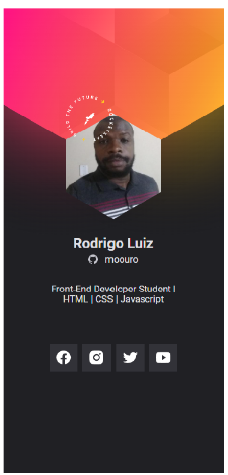

## Crachá virtual NLW HEART 

  
  <!--  -->

[NLW HEART](https://moouro.github.io/cracha-nlw-heart/)

## Usado na codificação:
### Editor de texto padrão
- [x] VSCODE

### Tecnologias usada 
- [x] HTML
- [x] CSS
- [x] JS
